# Rules
### Original Rules Set
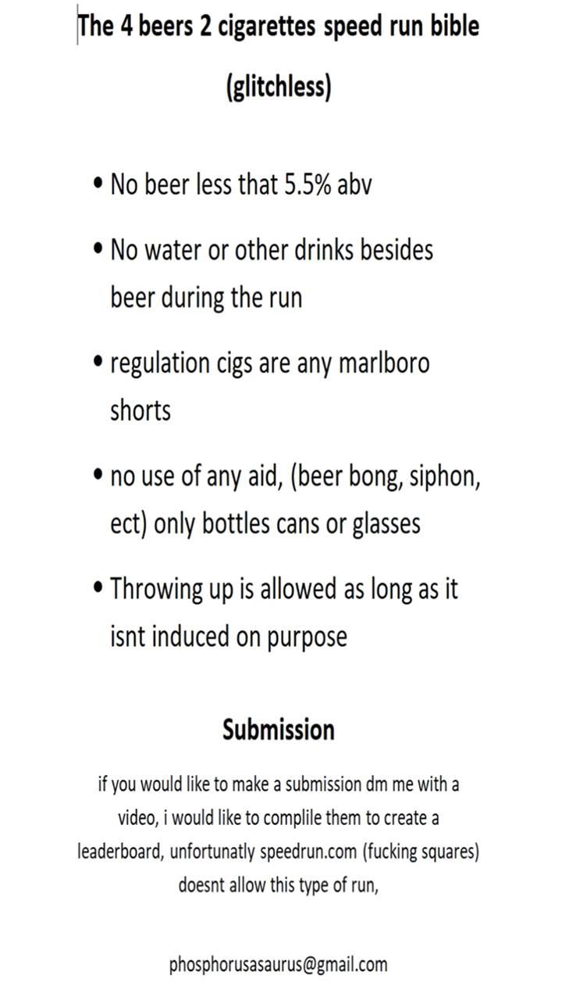
### Rules Updated on 8-28 live stream
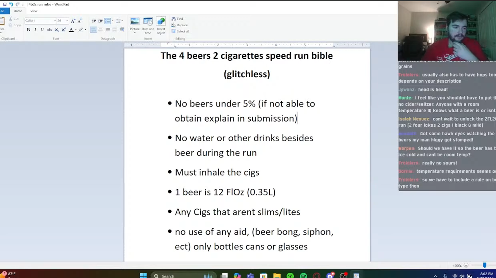
### 09-01 Updated Rules for Glitchless

### 09-02 Updated Rules for Any%
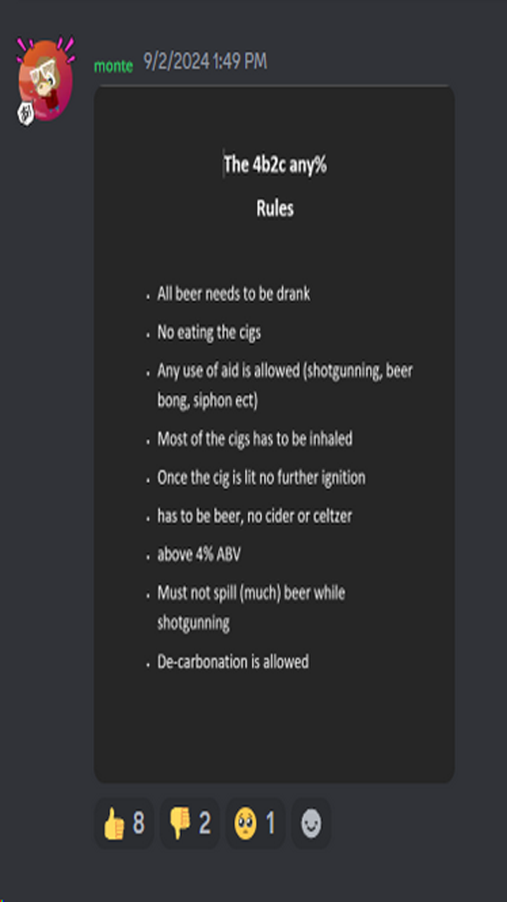
### 09-25 amended a rule
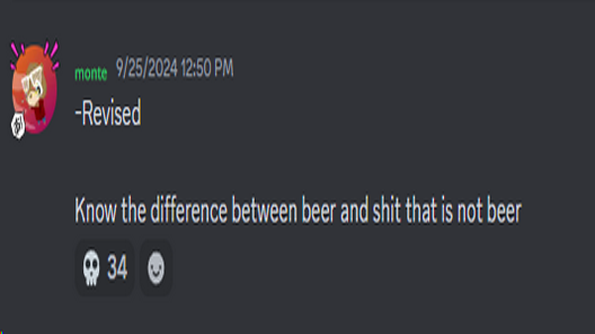
### 10-01 Added a rule for safety
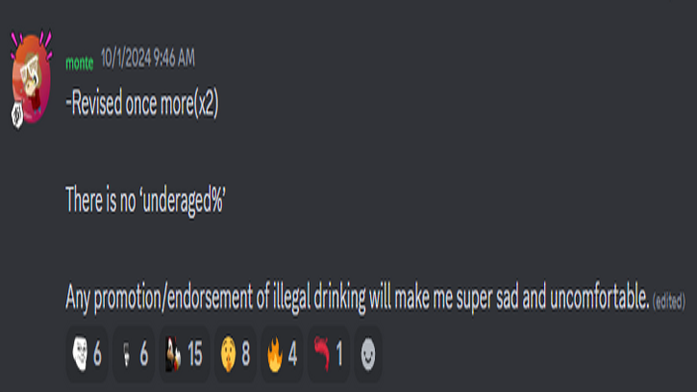
### 11-20 Rule sheet updated for the Glitchless
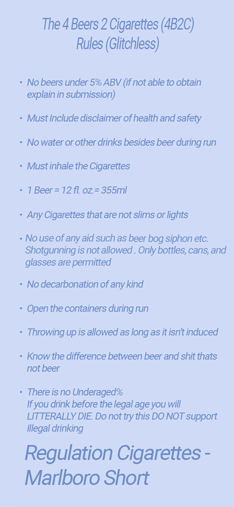
### 11-20 Rule sheet updated for the Any%
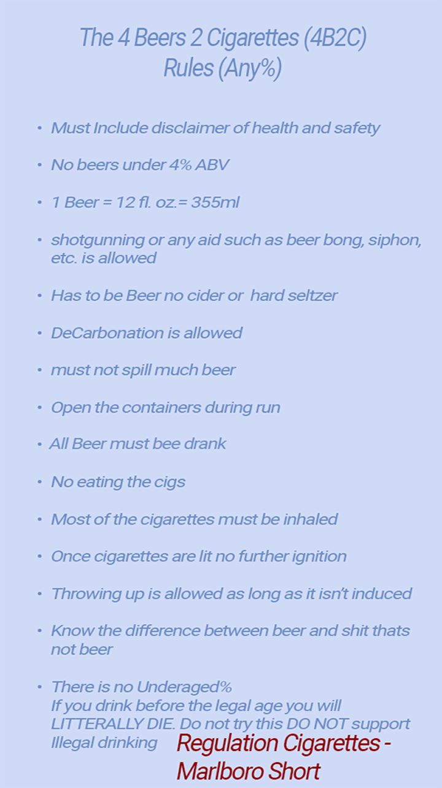
# **Sites**
## [4B2C Reddit](https://www.reddit.com/r/4B2C/)
## [Leaderboard - credit to Gold Fish](https://4b2c.net/)
# **Runners**
## [Stanky Kong](https://www.youtube.com/@StankyKong911)
#### The creator of the challenge 
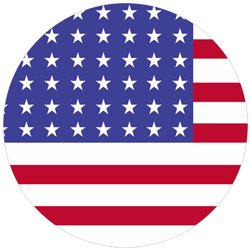
### [Glitched](https://www.youtube.com/watch?v=bTU5OCe_bvs)
#### Original removed by Youtube but Reuploaded on August 20th, 2024
#### Time -- 14:34.13
#### Beer: Busch Ice 5.9% ABV
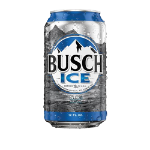
#### Cigarettes: Marlboro Black
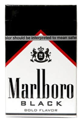
#### Nicotine 0.6mg
Tar 10mg
### [TAS](https://www.youtube.com/watch?v=eAI5fsQWr_g)    08-20, 2024
#### Time -- 7:27.9
#### Beer: Natural Ice 5.9% ABV
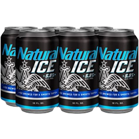
#### Cigarettes:

#### Nicotine 0.6mg
#### Tar 10mg
### [Glitchless](https://www.youtube.com/watch?v=2TQS88MSrXI&t=21s)    08-17-24
#### Time -- 8:29.61 
#### Beer: Natural Ice 5.9% ABV

#### Cigarettes:

#### Nicotine 0.6mg
#### Tar 10mg
## [PUR3LY4VIEWS](https://www.youtube.com/@PUR3LY4VIEWS)
#### Most Controversial runner

### [Any%](https://www.youtube.com/watch?v=G0of2OlIi1g)       08-18-24
#### Time -- 7:17
#### Beer: Smirnoff Ice Red, White, and Berry 4.5% ABV

#### Cigarettes: Marlboro Red
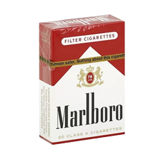
#### tar – 10 mg
#### nicotine – 0.8 mg
#### carbon monoxide – 10 mg
### [Glitched](https://www.youtube.com/watch?v=asir-2Umn-A)     08-19-24
#### Time -- 6:40
#### Beer: Not Your Fathers Root Beer 5.9% ABV
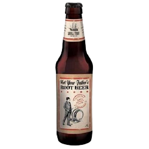
#### Cigarettes: Marlboro Red

#### tar – 10 mg
#### nicotine – 0.8 mg
#### carbon monoxide – 10 mg
### [Glitched](https://www.youtube.com/watch?v=PeDyjBiVI34)      08-22-24
#### Time -- 3:22
#### Beer: Not Your Fathers Root Beer 5.9% ABV

#### Cigarettes: Marlboro Red

#### tar – 10 mg
#### nicotine – 0.8 mg
#### carbon monoxide – 10 mg
### [TAS](https://www.youtube.com/watch?v=SxGkKutpNmA)       08-23-24
#### Time -- 3:23
#### Beer: Not Your Fathers Root Beer 5.9% ABV

#### Cigarettes: Marlboro Red

#### tar – 10 mg
#### nicotine – 0.8 mg
#### carbon monoxide – 10 mg
### [Glitched](https://www.youtube.com/watch?v=gVbjNQN4AL8&t=74s)     09-23-24
#### Time -- 1:18
#### Beer: Not Your Fathers Root Beer 5.9% ABV

#### Cigarettes: Marlboro Red

#### tar – 10 mg
#### nicotine – 0.8 mg
#### carbon monoxide – 10 mg
### [Glitched](https://www.youtube.com/watch?v=CCfB0YPKddI)     09-25-24
#### Time -- 0:59
#### Beer: Not Your Fathers Root Beer 5.9% ABV

#### Cigarettes: Marlboro Red

#### tar – 10 mg
#### nicotine – 0.8 mg
#### carbon monoxide – 10 mg
#### Comments
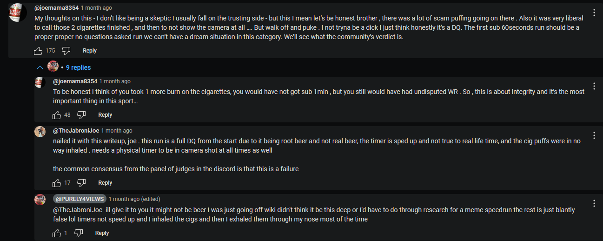
### [Glitched](https://www.youtube.com/watch?v=j6sGLvxS3CM&t=6s)     09-29-24
#### Time -- 1:02
#### Beer: Not Your Fathers Root Beer 5.9% ABV

#### Cigarettes: Marlboro Red

#### tar – 10 mg
#### nicotine – 0.8 mg
#### carbon monoxide – 10 mg
## [Dornia](https://www.youtube.com/@smegmagician)

### [Glitched](https://www.youtube.com/watch?v=uEaa4_KHMxk) 08-22-24
#### Time -- 3:25
#### Beer: Cariboo Genuine Draft 5.5% ABV
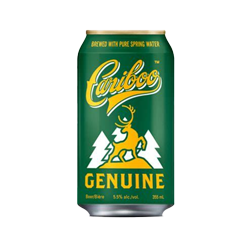
#### Cigarettes: Marlboro Vibe White mint
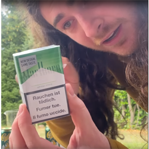
#### tar – 6 mg
#### nicotine – 0.5 mg
#### carbon monoxide – 7 mg
### [Pure%](https://www.youtube.com/watch?v=p3HZrvoREzg) 08-24-24
#### Time -- 04:02
#### Beer: Sparkling water
#### Cigarettes: Marlboro White Mint

#### tar – 6 mg
#### nicotine – 0.5 mg
#### carbon monoxide – 7 mg
### [IPA%](https://www.youtube.com/watch?v=b9hj-Qn5rQM) 08-24-24
#### Time -- 2:54:08
#### Beer: Fat Tug IPA 7%ABV
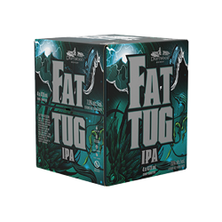
#### Cigarettes: Marlboro White Mint

#### tar – 6 mg
#### nicotine – 0.5 mg
#### carbon monoxide – 7 mg
### [Glitchless](https://www.youtube.com/watch?v=uczA_1HIqYk&t=1s) 09-04-24
#### Time -- 1:41
#### Beer: Cariboo Genuine Draft 5.5% ABV

#### Cigarettes: A chesterfield  and a Lucky Strike in a Camel Orange Box
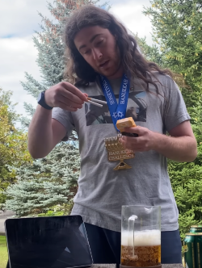
#### A chesterfield Original has 11mg tar 0.8mg nicotine
[Source](https://youtu.be/T0xDY-4F6UY?si=m11dGNwZ7iYIbqCW&t=661)
#### A Lucky strike Original has 12mg tar and 0.8mg nicotine
[Source](https://www.ciggiesworld.ch/product/lucky-strike-original/)
#### The Camel orange cigarettes  have 8mg tar and 0.7mg nicotine
[Source](https://tabak.kkiosk.ch/en/products/camel-orange-box)
#### cant verify that they are actually not Camel orange cigarette which is on the  lighter side being und 10mg of tar
### [Any%](https://www.youtube.com/watch?v=n6nf1g4naJE) 09-20-24
#### Can't see beer being poured and the vessel Is opaque 
#### Time -- 1:20
#### Beer: La Bittt à Tibi - Blonde Lager 5% ABV
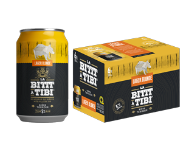
#### Cigarettes: Next Xtras
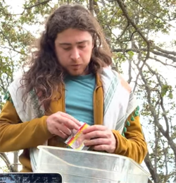
### [Glitchless](https://www.youtube.com/watch?v=kuVIELdBDfo&t=199s) 09-23-24
#### Time -- 1:05:18
#### Beer: Cariboo Blonde 5.5% ABV
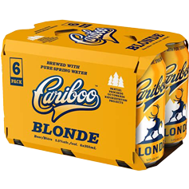
#### Cigarettes: Next Xtras 

#### Tar and Nic unknown but it is their Full flavor cigarette so id bet its got 10mg+ tar and definitely isn't perforated for air flow 
### [Glitchless](https://www.youtube.com/watch?v=yGhKMU5agFA&t=9s) 09-24-24
#### Time -- 1:10
#### Beer: Cariboo Blonde 5.5% ABV

#### Cigarettes: Next Xtras 

#### Tar and Nic unknown but it is their Full flavor cigarette so id bet its got 10mg+ tar and definitely isn't perforated for air flow 
### [Hang%](https://www.youtube.com/watch?v=ZyL0vHhai_o) 09-27-24
#### Time -- 11:07
#### Beer: Arcus Pilsner 5% ABV
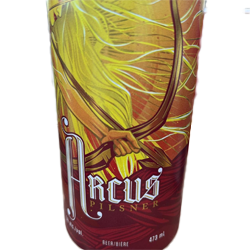
#### Cigarettes: Next Xtras 

#### Tar and Nic unknown but it is their Full flavor cigarette so id bet its got 10mg+ tar and definitely isn't perforated for air flow 
### [Glitchless](https://www.youtube.com/watch?v=DXisiEyQsbY&t=5s) 10-06-24
#### Time -- 1:01:21
#### Beer: Cariboo Blonde 5.5% ABV

#### Cigarettes: Next Xtras 

#### Tar and Nic unknown but it is their Full flavor cigarette so id bet its got 10mg+ tar and definitely isn't perforated for air flow 
### [12 Beer 20 Cigarette](https://kick.com/playingwithmyshit/videos/d3707031-106e-4eaa-8697-ce3f01078526)
#### Cigarettes: American Spirit Green
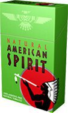
#### Tar
#### Nic
#### Beer: Cariboo Genuine Draft 5.5% ABV

#### Fat Tug IPA 7%ABV

#### Spiff Corn Lager 5.1%ABV
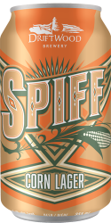
## [Kane](https://www.youtube.com/@KANESEASON)
### [Glitchless](https://www.youtube.com/watch?v=f4MeKjF2LeM) 08-24-24
#### Time -- 5:00 
#### Beer: Bud Light Platinum 6%ABV
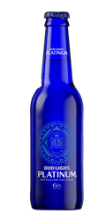
#### Cigarettes: Marlboro Red

#### tar – 10 mg
#### nicotine – 0.8 mg
#### carbon monoxide – 10 mg
### [Any%](https://www.youtube.com/watch?v=G5HDrKH1tWQ)
#### Time -- 2:31
#### The "beer" was pre poured before recording
#### Beer: Modelo Especial 4.5% ABV
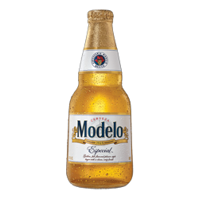
#### Cigarettes: Marlboro Red

#### tar – 10 mg
#### nicotine – 0.8 mg
#### carbon monoxide – 10 mg 
## [DoobyScoo](https://www.youtube.com/@doobyscoo2340/videos)
### [Any%](https://www.youtube.com/watch?v=fby3QNRdLn0)  08-24-24
#### Time -- 3:32
#### Beer Poured before start of recording
#### Beer: Unknown Apparently 5.9% ABV
#### Poured before the video the claim they are 5.9% ABV 
#### Cigarettes: Unknown
## [theoldcancer](https://www.youtube.com/@theoldcancer)
### [glitched upper decky](https://www.youtube.com/watch?v=eWL9r79OnyU) 08-25-24
#### Time -- 5:54 
#### Gave up after 3 Beers and 1 cigarette
#### Beer: Coors Light 4.2% ABV
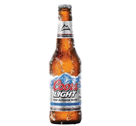
#### Cigarettes: NewPort Originals
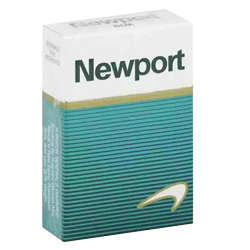
#### 11mg Tar
#### 0.8mg nic
## [BonsaiKush](https://www.youtube.com/@hashausmadrid2453)
### [any% Glitchless](https://www.youtube.com/watch?v=2kGwyv2ZkQs) August 25th, 2024
#### Time -- 4:14
#### does pour a lot of foam out of each finished bottle
#### Beer: rothaus-tannenzapfle 5.1% ABV
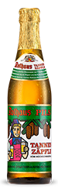

#### Cigarettes: unknown
## [Joe Mama](https://www.youtube.com/@joemama8354)
### [any% Glitchless](https://www.youtube.com/watch?v=297lyznwpxs) 09-14-24
#### Time -- 1:34
#### Beers: Paulaner Weisbier 5.5% ABV
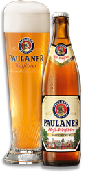
#### Cigarettes: Benson and Hedges Silver

#### [Benson & Hedges Silver Cigarettes These king size cigarettes are medium in strength](https://www.johnnystobacconist.co.uk/product/benson-hedges-silver-cigarettes/?age-verified=97ea5aeeb2)
### [Pukeless% Attempt](https://www.youtube.com/watch?v=LJsnh6D8mXg) 
#### Time -- 1:29 gives in 
#### Beers: Hammerhead stout 5.6% ABV
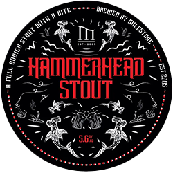
#### Cigarettes: Sterling dual
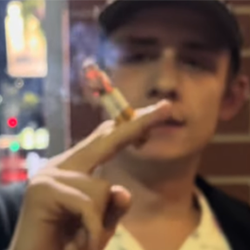
#### Practice run using super king sized cigarettes 
### [Golden Run](https://www.youtube.com/watch?v=ohIvCTubBI8) 09-21-24
#### Time -- 1:42.82
#### Beers: Wobbly Bob 6.0%ABV
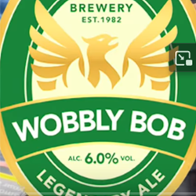
#### Cigarettes:  Chesterfield Red Superking
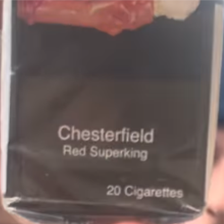
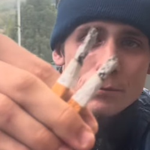
#### hosts some ideas for naming of categories 
### [Any% Glitchless](https://www.youtube.com/watch?v=fjvo-L3a0pI) 09-24-24
#### Time -- 1:17 
#### Beers: Wobbly Bob 6.0%ABV

#### Cigarettes: Marlboro Red

#### tar – 10 mg
#### nicotine – 0.8 mg
#### carbon monoxide – 10 mg
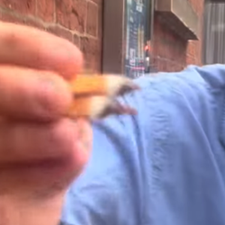
### [3 4B2C Attempts](https://www.youtube.com/watch?v=aOtjef1a0-E)
#### Time -- 
#### Beers:
#### Cigarettes:
## [GTSY](https://www.youtube.com/@GTSYprod)

### [Any% Glitchless](https://www.youtube.com/watch?v=Bdbzmm69eD0) 09-10-24
#### Time -- 3:24.51
#### Beers: Heineken 355ml 5.0% ABV
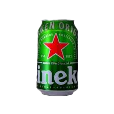
#### Cigarettes: Players KingSize
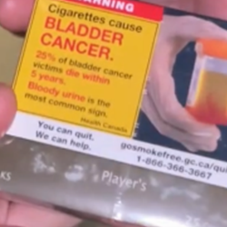
#### Tar 11mg 
#### Nic 0.8mg
[Source](https://acsjournals.onlinelibrary.wiley.com/doi/pdf/10.1002/1097-0142%28196904%2923%3A4%3C910%3A%3AAID-CNCR2820230428%3E3.0.CO%3B2-0)
## [Tina](https://www.youtube.com/@Tina-bh9hv)

### [Any% Glitchless](https://www.youtube.com/watch?v=HLaXk2mwctw) 09-24-24
#### Time -- 1:34
#### Beers: Draft beer believed to be 5.5%+ ABV 2, 330ml and 2 500ml 
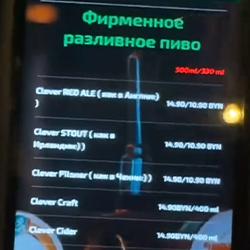
#### Cigarettes: Lucky Strike Compact Bright
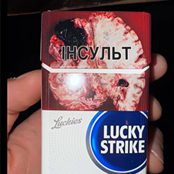
#### Tar - 6mg
#### Nic - 0.5mg
#### I would not consider these on par with Marlboro Shorts as they are too small and too light
#### "The content of the tar and nicotine in these cigarettes follows the standard indicators where:
#### Resin is: 6 mg, and nicotine - 0.5 mg."
[Source](https://latela.ru/sigarety-lucky-strike-compact-bright.html)
#### "Well, I will remind you that the compact Lucky Strike are one of the most 
#### compact, having a shorter length and diameter compared to, for example, with the "Pholype Maurice Expert"."
[Source](https://dzen.ru/a/Y39AQ2pgtBQl5kZW)
## [Based Mod](https://www.youtube.com/@basedmod2139)

### [Any% Glitchless](https://www.youtube.com/watch?v=uhycE9OE6NU) 09-10-24
#### Time -- 4:10
#### Beers: Heineken 355ml 5.0% ABV

#### Cigarettes: Players KingSize

#### Tar 11mg 
#### Nic 0.8mg
[Source](https://acsjournals.onlinelibrary.wiley.com/doi/pdf/10.1002/1097-0142%28196904%2923%3A4%3C910%3A%3AAID-CNCR2820230428%3E3.0.CO%3B2-0)
## [sethlucca](https://www.youtube.com/@sethlucca)
### [Any% Glitched](https://www.youtube.com/watch?v=s0r3qA5bnYs)
#### Time -- 3:24
#### No cigarettes used and ABV of 4.6% not gonna cut it 
#### Beers: Corona Extra 4.6% ABV
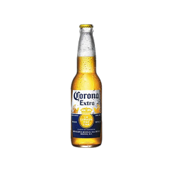
#### Cigarettes: 2 Blinkers on a vape who knows nicotine content 
## [ypilled](https://www.youtube.com/@ypilled)
### [Any% Glitchless](https://www.youtube.com/watch?v=hAEHlwVwbAs) 09-22-24
#### Time -- 1:28:80
#### Beer: Tsingtao 4.5% ABV
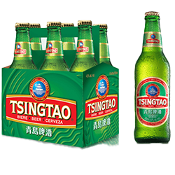
#### Cigarettes: Pall Mall Smooths
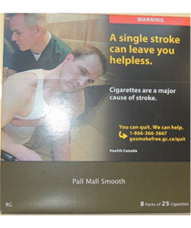
#### Tar - 7mg
#### Nic - 0.6mg
## [Hudlands Chugs](https://www.youtube.com/@hudlandschugs)
### [4B2J](https://www.youtube.com/watch?v=a7RpirCxYyU) 10-10-24
#### Time -- 3:39
#### Beers: Carling Black Ice 6.1% ABV
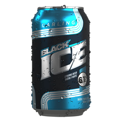
#### Joints: Pure Sunfarms Gold Face 25.1%
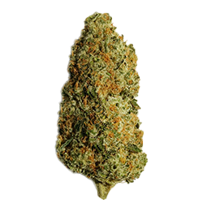
#### [Source](https://puresunfarms.com/strains/gold-face/)
## [Goontang](https://www.youtube.com/@goontang4000)
#### M. Watson
### [Any% Glitchless](https://www.youtube.com/watch?v=rfp2OdhTgFg)
#### Time -- 2:45:46
#### Beer: Orange Blossom Honey Pilsner 5.5%ABV
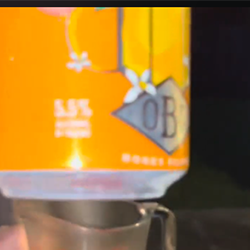
#### Cigarettes: Marlboro Red

#### tar – 10 mg
#### nicotine – 0.8 mg
#### carbon monoxide – 10 mg
## [BoySpook](https://www.youtube.com/@BoySpook)
### [Any% Glitchless](https://www.youtube.com/watch?v=4bH-tctoOAg) 10-06-24
#### Time -- 2:48
#### Beer: san martinez 5.0 ABV

#### Cigarettes: American Spirits assuming blue 

#### Tar - 15mg 
#### nic - 1.6mg
## [spudbrain](https://www.youtube.com/@rabbitguy337)
### [Any% Glitchless](https://www.youtube.com/watch?v=Xb5R4Dkw19Y&t=27s) 10-17-24
#### Time -- 1:21
#### Beer: Farmers Brewing Co. 530 5% ABV
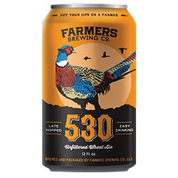
#### Cigarettes: Lucky Strike originals

#### Tar - 10mg
#### Nic - 0.8mg
## [Sander Philips](https://www.youtube.com/@sanderphilips8156)
### [5B2C](https://www.youtube.com/watch?v=dLXVGA0N2I8)
#### Beer poured before recording 
#### Time -- 2:40
#### Beer:unknown pre poured
#### Cigarettes: unknown, cork filter
## [Monke Mum](https://www.youtube.com/@monkemum6400)
### [Any% Glitchless](https://www.youtube.com/watch?v=Ksfv7lca34E)
#### Time -- 5:30
#### Beer: perla 5.2% ABV
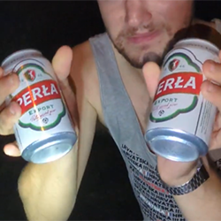
#### Cigarettes: Camel 100
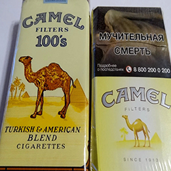
#### Tar 16mg
#### Nic 1.1mg
## [Will Beer](https://www.youtube.com/@willbeer2980)
### [Any% Glitchless](https://www.youtube.com/watch?v=Wpc-j2lyvBc) 
#### Time -- 3:39
#### Beer: Coors Banquet
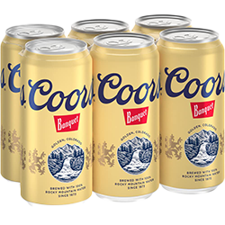
#### Cigarettes: Lucky strike Red

#### Tar 10mg 
#### Nic 0.8mg
## [Der Grobe](https://www.youtube.com/@DerGrobe-v1c)
### [Any% Glitchless](https://www.youtube.com/watch?v=VXwu1w7Wjg8) 
#### Time --00:59
#### Beer: unknown
#### Cigarettes:unknown 
## [Purely Natty](https://www.youtube.com/@purelynatty)
### [Any%](https://www.youtube.com/watch?v=ax40EnO-c4M) 11-13-24
#### Time --2:56
#### Beer: Natural Light 4.2%ABV

#### Cigarettes: Marlboro menthol

#### Tar 9mg
#### Nic0.7mg

### [Any%](https://www.youtube.com/watch?v=mgE3lmX3HXk) 11-14-24
#### Time -- 2:19
#### Beer: Michelob ultra 4.2% 

#### Cigarettes: Marlboro menthol

#### Tar 9mg
#### Nic0.7mg

### [Any%](https://www.youtube.com/watch?v=mgE3lmX3HXk) 11-18-24
#### Time -- 2:02
#### Beer: Michelob ultra 4.2% 

#### Cigarettes: Marlboro menthol

#### Tar 9mg
#### Nic0.7mg

## [zombs](https://www.youtube.com/@zombs1388)
### [Any% Glitchless](https://www.youtube.com/watch?v=R2mzdwyxIj8) 10-06-24
#### Time -- gave up at 0:45 seconds 
#### Beer: dont, know from a pub
#### Cigarettes: dont know
## [letmark](https://www.youtube.com/@letmark111)
### [Any% Glitchless](https://www.youtube.com/watch?v=qRT8x1Pqu_U) 
#### Time --
#### Beer: Bron Lager

#### Cigarettes: look like marlboro shorts

## [Vallahfilm](https://www.youtube.com/@6617-g9v)
### [Any% Glitchless](https://www.youtube.com/watch?v=Vdisams7Q9E) 
#### Time --1:39
#### Beer:

#### Cigarettes:

## [Nicholas P](https://www.youtube.com/@nicholasp314)
### [Any% Glitchless](https://www.youtube.com/watch?v=IYD2yHBMjic) 
#### Time --
#### Beer:
#### Cigarettes:
## [SlowGhetti](https://www.youtube.com/@slowghetti2790)
### [Any% Glitchless](https://www.youtube.com/watch?v=WjP5i8CPPQo) 09-27-24
#### Time --
#### Beer:
#### Cigarettes: 
### [Any% Glitchless](https://www.youtube.com/watch?v=AsLNjmdDXA4) 10-19-24
#### Time --
#### Beer:
#### Cigarettes: 
## [Ian Finn](https://www.youtube.com/@ianfinn3585)
### [Hang% Glitchless](https://www.youtube.com/watch?v=dlIm6s1MO30) 
#### At 22:10 Ian Offers commentary on the ABV Rules that I think is good
#### Time --
#### Beer:
#### Cigarettes:
## [jibby jib](https://www.youtube.com/@jibbyjibbb)
### [Any% Glitchless](https://www.youtube.com/watch?v=FajK0Gk0sKw) 
#### Time --
#### Beer:
#### Cigarettes:
## [DegenMax](https://www.youtube.com/@DegenMaxx)
### [4B2J](https://www.youtube.com/watch?v=BvsHn-6FK94) 09-25-24
#### Time --
#### Beer:
#### Cigarettes:
### [4B2J](https://www.youtube.com/watch?v=_iaZ4spDuis) 10-13-24
#### Time --
#### Beer:
#### Cigarettes:
## [yako](https://www.youtube.com/@Yako-i1i)
### [Any% Glitchless](https://www.youtube.com/watch?v=IQLlXaeKJbI) 
#### Time --
#### Beer:
#### Cigarettes:
## [Femtastic.420](https://www.youtube.com/@femtastic420)
### [Any% Glitchless](https://www.youtube.com/watch?v=ilAIS1RF_XE) 
#### Time --
#### Beer:
#### Cigarettes:
## [Cal](https://www.youtube.com/@Smuggerz)
### [Any% Glitchless](https://www.youtube.com/watch?v=UWuJeMZiTe8) 
#### Time --
#### Beer:
#### Cigarettes:
## [GuryDub](https://www.youtube.com/@gurydub)
### [4S2J](https://www.youtube.com/watch?v=mcUU_D5RK0M) 
#### Time --
#### Beer:
#### Cigarettes:
## [Rain](https://www.youtube.com/@Rain-py9wi)
### [GWN%](https://www.youtube.com/watch?v=lKOaF7SQMRA&t=2s) 09-20-24
#### Time -- 5:05:20
#### "Cooler":
#### Weed:
### [GWN%](https://www.youtube.com/watch?v=s-f7Fms6wLU&t=1s) 09-23-24
#### Time -- 3:36:66
#### "Cooler":
#### Weed:
### [GWN%](https://www.youtube.com/watch?v=5iwstSQzLhk) 10-03-24
#### Time -- 2:31:19
#### "Cooler":
#### Weed:
### [GWN%](https://www.youtube.com/watch?v=B2jj0pCuWZA) 10-15-24
#### Time -- 2:05:89
#### "Cooler":
#### Weed:
# Coverage/Compilations
## [Chadman](https://www.youtube.com/@chadman8425)
### [4 BEERS 2 CIGARETTES: A Speedrun History](https://www.youtube.com/watch?v=H1I9YOAtlIc) 10-05-24
## [Die deutschen Backrooms](https://www.youtube.com/@DiedeutschenBackrooms)
### [Die 4 Bier 2 Zigaretten Speedruns gehen hart](https://www.youtube.com/watch?v=I4jnJq7-cnk) 10-13-24
### "The 4 Beer 2 Cigarettes Speedruns Go Hard"
## [Sneebs](https://www.youtube.com/@snbbbs)
### [4B2C - The Rules of 4 Beer 2 Cigarette](https://www.youtube.com/watch?v=aJFwwyayVb4) 10-13-24
## other
### [MSC 4B2C](https://www.youtube.com/watch?v=2a7dr9Xj_ZI)
### [rdr2 4 beers 2 cigarettes](https://www.youtube.com/watch?v=S3arCFglgFQ)
# Who AM I?
## [Sneebs](https://www.youtube.com/@snbbbs) 

### I'm Sneebs You can find me on youtube for now but I plan to expand, Stop By for a Livestream or Watch my [Newewst Video](https://www.youtube.com/watch?v=ZOm_I921iw4)
